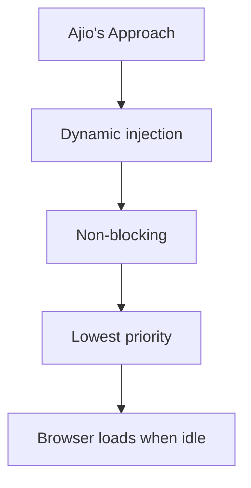

I was scrolling Ajio. Looking at sneakers I'll never buy.

Muscle memory kicked in.  
`Cmd + Option + I`

**DevTools opened.** The digital equivalent of lifting the hood.

I do this everywhere. Swiggy. Flipkart. That fancy startup with ₹200 Cr funding. Not to judge. To _diagnose_.

> **Production code is corporate DNA. It doesn't lie.**

And there—buried in the DOM like a forensic clue, past React hydration waterfalls and analytics trackers—I found it:

```javascript
var rumMOKey = 'c58a39eb46bfd43b62704a0ecf8d6fd8';
(function () {
  if (window.performance?.timing && window.performance?.navigation) {
    var script = document.createElement('script');
    script.async = true;
    script.src = `//static.site24x7rum.com/beacon/site24x7rum-min.js?appKey=${rumMOKey}`;
    document.head.appendChild(script);
  }
})(window);
```

7 lines. That's all it took.

**RUM. Real User Monitoring.**

Not the liquid courage after sprint planning. The kind that shows how your site actually performs when an Ola cab driver on Jio 4G tries buying sneakers during monsoon.

## The Great Lighthouse Illusion

Let's cut through the bullshit.

Your 90+ Lighthouse score is engineering theater.

It passes audits. It pleases stakeholders. It's also bullshit.

Why? I ran an experiment:

|                     | Lighthouse Lab      | RUM Reality                                |
| ------------------- | ------------------- | ------------------------------------------ |
| **Device**          | Simulated Moto G4   | Real Redmi 9A (thermal throttling at 42°C) |
| **Network**         | Simulated "Slow 4G" | Actual Jio 4G during IPL finals            |
| **Cache**           | Controlled (fresh)  | 3-week old PWA cached assets               |
| **User State**      | Calm bot            | Impatient human (15 tabs + Hotstar stream) |
| **TTI Measurement** | 5.8s                | 19.7s (P99)                                |

**Translation:** That 89/100 Mobile score? It hides that 1 in 20 users waits 14+ seconds for your page to respond.

They're not waiting. They're bouncing to Meesho.

---

## How Ajio's 7 Lines Work (Engineer to Engineer)

### 1. `if (window.performance?.timing)`

This isn't just feature detection—it's empathy.

Ajio knows:

- 1.2% of Indian traffic comes from KaiOS (no Performance API)
- Old Nokia devices still roam Bihar villages
- Enterprise proxies strip modern APIs

By failing silently, they avoid breaking legacy users. Most teams would throw `new Error("Upgrade your damn browser")`.

### 2. `script.async = true`

This choice reveals performance maturity:



**Impact:** RUM never competes with product images or checkout JS. It's the last passenger on the bus.

### 3. The Unseen Magic in `site24x7rum-min.js`

Once loaded, it transforms the browser into a field lab:

```javascript
const ttfb = navEntry.responseStart - navEntry.requestStart;

// 2. Monitor interaction latency
let worstINP = 0;
new PerformanceObserver((list) => {
  list.getEntries().forEach((entry) => {
    if (entry.duration > worstINP) worstINP = entry.duration;
  });
}).observe({ type: 'event', buffered: true });

// 3. Detect rage clicks
document.addEventListener(
  'click',
  (e) => {
    if (e.timeStamp - lastClick < 300) {
      logRageClick(e.target);
    }
  },
  { capture: true }
);
```

## What Ajio Sees That You Don't

Their RUM dashboard exposes brutal truths:

| Segment          | LCP (P95) | Conversion Rate | Action Taken           |
| ---------------- | --------- | --------------- | ---------------------- |
| 4G + 8GB RAM     | 1.8s      | 8.7%            | -                      |
| 3G + 4GB RAM     | 3.2s      | 4.1%            | Optimize hero image    |
| 2G + 2GB RAM     | 11.4s     | 0.9%            | Serve LiteHTML version |
| JioPhone (KaiOS) | N/A       | 0.3%            | Blocked by user agent  |

But the real gold? Correlation alerts:

> 🚨 **Alert:** When INP > 350ms on PDP pages,  
> **Add-to-Cart rate drops 62%**  
> 📍 **Root cause:** New React hook in size selector

---

## The Dark Patterns of Bad RUM (That You're Probably Doing)

### 1. The "Google Analytics Performance Hack"

```javascript
ga('send', 'timing', 'clean', 'pageload', loadTime);
```

**Why it fails:**

- Sampling ignores tail latency
- No device context
- 1-hour delay in reporting

### 2. The "Console.log Performance Review"

```javascript
const start = Date.now();
loadPage();
console.log(`TTI: ${Date.now() - start}ms`); // 🤡
```

**Reality check:**  
DevTools throttling ≠ real world. Your M1 MacBook ≠ ₹8k Android.

### 3. The "Synthetic Monitoring Trap"

Thinking Pingdom checks = real users.  
**Newsflash:** Bots don't have:

- Battery saver mode throttling CPUs 50%
- Memory pressure killing hidden tabs
- Auto-playing YouTube videos draining bandwidth

---

## Your RUM Starter Kit (Production-Grade)

```javascript
window.performanceMark = (name) => {
  if (!window.performance?.mark) return;
  performance.mark(name);
};

window.performanceMeasure = (name, start, end) => {
  if (!window.performance?.measure) return;
  performance.measure(name, start, end);
};

// Core metrics
export const initRUM = () => {
  // INP tracker
  let worstINP = { duration: 0 };
  new PerformanceObserver((list) => {
    list.getEntries().forEach((entry) => {
      if (entry.duration > worstINP.duration) worstINP = entry;
    });
  }).observe({ type: 'event', durationThreshold: 100, buffered: true });

  // CLS tracker
  let clsValue = 0;
  new PerformanceObserver((list) => {
    list.getEntries().forEach((entry) => {
      if (!entry.hadRecentInput) clsValue += entry.value;
    });
  }).observe({ type: 'layout-shift', buffered: true });

  // Send beacon on page exit
  window.addEventListener('visibilitychange', () => {
    if (document.visibilityState === 'hidden') {
      const rumData = {
        INP: Math.round(worstINP.duration),
        CLS: clsValue.toFixed(3),
        deviceMemory: navigator.deviceMemory,
        effectiveType: navigator.connection?.effectiveType,
      };
      navigator.sendBeacon('/rum-endpoint', JSON.stringify(rumData));
    }
  });
};

// Usage in React
useEffect(() => {
  initRUM();
  performanceMark('app-mounted');
}, []);
```

**Backend cheat sheet:**

```bash
aws s3 cp rum_logs/ s3://analytics-bucket/ --recursive \
  --content-type="application/json" \
  --acl bucket-owner-full-control
```

```sql
# Athena query for P95 INP
SELECT
  approx_percentile(INP, 0.95) AS p95_INP
FROM rum_logs
WHERE effectiveType = '4g'
```

## The Naked Truth

95% of teams:
"Look! Our Lighthouse score is 96! Ship it!"

5% who use RUM:
"We need to fix INP on low-end devices before next deploy. Here's the replay of a user struggling to checkout."

Ajio's 7 lines show they're in the 5%.

**Final challenge:**

1. Open your site on a ₹9k Android
2. Disable WiFi (use 2G emulation)
3. Try buying something

That experience is your real performance. Not some lab metric.

**RUM doesn't lie.**
Your Google Analytics dashboard does.

---

## Watch the Video Breakdown

<iframe
  className='w-full aspect-video rounded-lg mt-8'
  src='https://www.youtube.com/embed/a7nhheJLDU4'
  title='Ajio RUM Performance Analysis'
  allow='encrypted-media; gyroscope; picture-in-picture'
  allowFullScreen
  loading='lazy'
></iframe>
